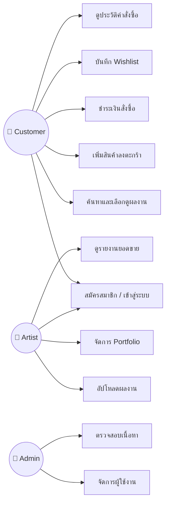
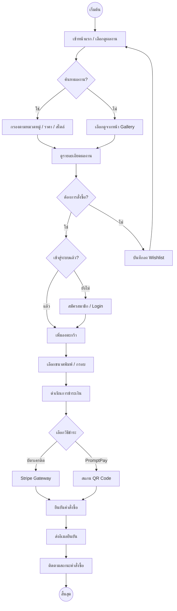
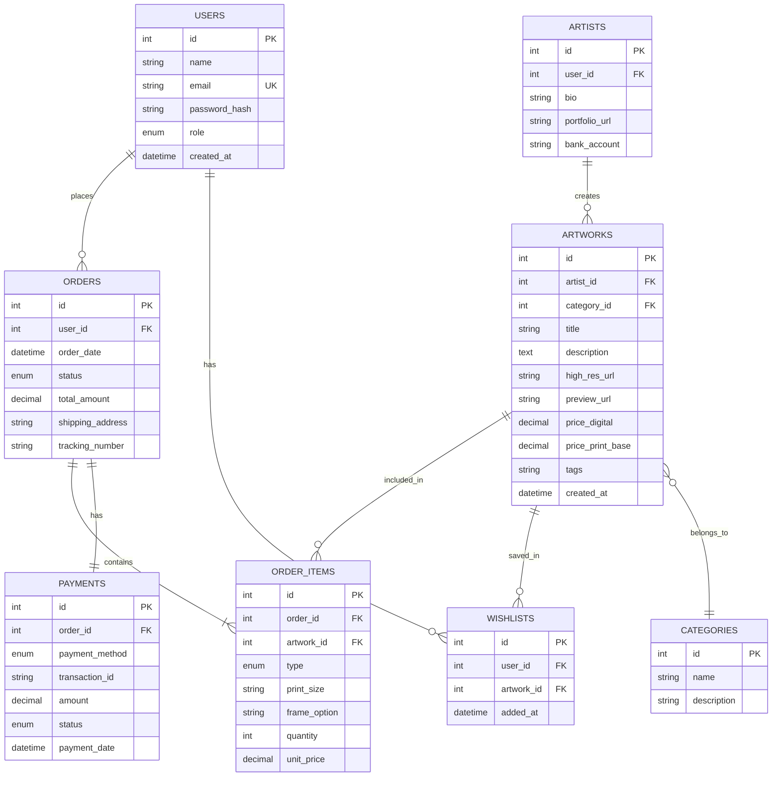
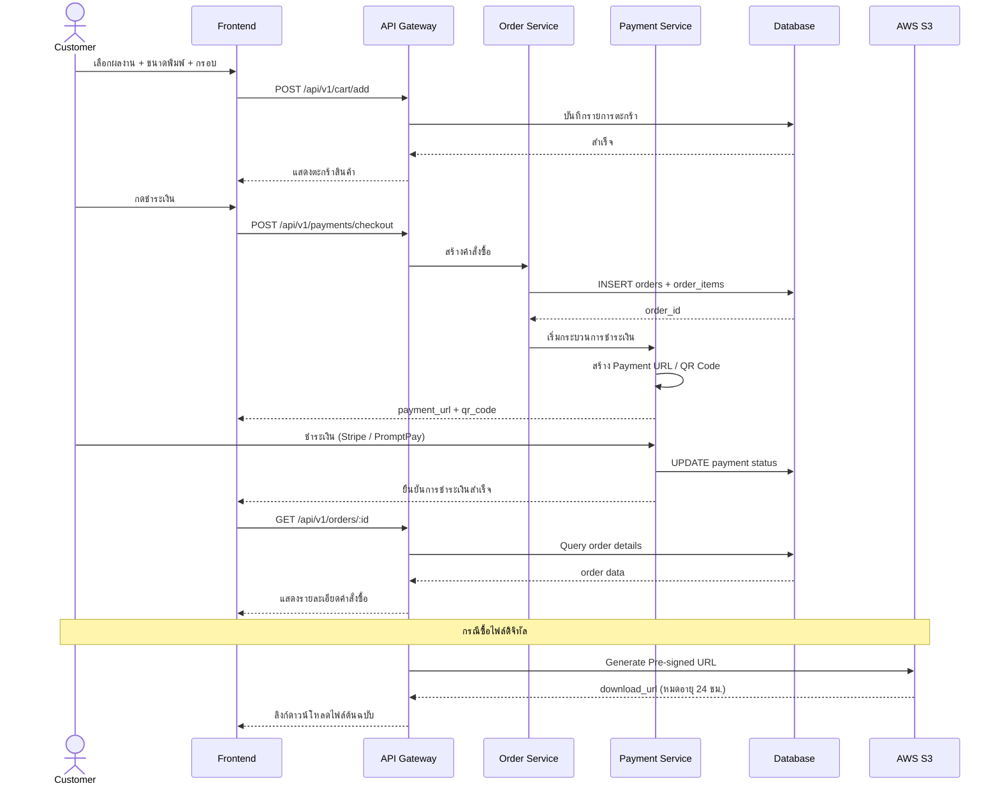
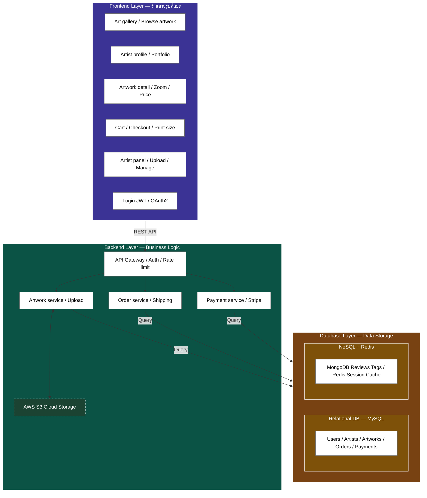

# 📋 เอกสารวิเคราะห์และออกแบบระบบ (Analysis & Design Document)
## ระบบร้านขายรูปภาพศิลปะออนไลน์ — Art Gallery Platform

---

## 1. บทนำ (Introduction)

### 1.1 วัตถุประสงค์ของระบบ (System Objectives)
ระบบร้านขายรูปภาพศิลปะออนไลน์ (**Art Gallery Platform**) พัฒนาขึ้นเพื่อเป็นแพลตฟอร์มที่เชื่อมต่อระหว่าง **ศิลปิน (Artists)** ผู้สร้างสรรค์ผลงาน และ **ลูกค้า (Customers)** ผู้สนใจสั่งซื้อผลงานศิลปะทั้งในรูปแบบไฟล์ดิจิทัลและงานพิมพ์คุณภาพสูง (Print on Demand)

### 1.2 ขอบเขตของระบบ (System Scope)
- รองรับการลงทะเบียนและเข้าสู่ระบบ (JWT / OAuth2)
- แสดงและค้นหาผลงานศิลปะตามหมวดหมู่ สไตล์ และศิลปิน
- สั่งซื้อและชำระเงินผ่านระบบออนไลน์ (Stripe / PromptPay)
- ศิลปินอัปโหลดผลงานพร้อมระบบ Watermark อัตโนมัติ
- ระบบจัดการคำสั่งซื้อ การพิมพ์ และจัดส่ง

### 1.3 ผู้ใช้งานระบบ (System Users / Stakeholders)
| ผู้ใช้ | บทบาท | ความต้องการหลัก |
|---|---|---|
| **ลูกค้า (Customer)** | ผู้ซื้อผลงานศิลปะ | ค้นหา เลือกดู สั่งซื้อ และชำระเงิน |
| **ศิลปิน (Artist)** | ผู้สร้างสรรค์ผลงาน | อัปโหลดผลงาน ตั้งราคา จัดการคำสั่งซื้อ |
| **ผู้ดูแลระบบ (Admin)** | ผู้ดูแลแพลตฟอร์ม | จัดการผู้ใช้ ตรวจสอบเนื้อหา ดูรายงาน |

---

## 2. การวิเคราะห์ความต้องการ (Requirements Analysis)

### 2.1 ความต้องการเชิงฟังก์ชัน (Functional Requirements)

#### FR-01: ระบบสมาชิกและการยืนยันตัวตน (Authentication & Authorization)
- ผู้ใช้สามารถสมัครสมาชิกด้วยอีเมลและรหัสผ่าน
- รองรับการเข้าสู่ระบบผ่าน OAuth2 (Google Account)
- ใช้ JWT (JSON Web Token) ในการจัดการ Session
- แบ่งระดับสิทธิ์การเข้าถึง: Customer, Artist, Admin

#### FR-02: ระบบแสดงผลงานศิลปะ (Art Gallery & Browsing)
- แสดงภาพตัวอย่างแบบ Watermark เพื่อปกป้องลิขสิทธิ์
- รองรับการค้นหาด้วยคำสำคัญ หมวดหมู่ แท็ก สีหลัก และช่วงราคา
- ซูมภาพเพื่อดูรายละเอียดของผลงาน
- แสดงข้อมูลศิลปินและผลงานที่เกี่ยวข้อง

#### FR-03: ระบบตะกร้าสินค้าและการสั่งซื้อ (Shopping Cart & Orders)
- เพิ่ม/ลบรายการในตะกร้าสินค้า
- เลือกขนาดพิมพ์ (A4, A3, A2, A1) และประเภทกรอบ (ไม้, อลูมิเนียม)
- คำนวณราคาค่าพิมพ์ กรอบ และค่าจัดส่งอัตโนมัติ
- บันทึกประวัติการสั่งซื้อและสถานะจัดส่ง

#### FR-04: ระบบชำระเงิน (Payment Gateway)
- รองรับการชำระเงินผ่าน Stripe (บัตรเครดิต/เดบิต)
- รองรับการชำระเงินผ่าน PromptPay (QR Code)
- แจ้งเตือนผลการชำระเงินผ่านอีเมลอัตโนมัติ

#### FR-05: ระบบจัดการสำหรับศิลปิน (Artist Dashboard)
- อัปโหลดไฟล์ภาพความละเอียดสูง (High-resolution)
- ระบบสร้าง Watermark อัตโนมัติก่อนเผยแพร่ตัวอย่าง
- ตั้งราคาขายไฟล์ดิจิทัลและราคาเริ่มต้นงานพิมพ์
- แดชบอร์ดแสดงสถิติยอดขายและจำนวนการเข้าชม

#### FR-06: ระบบรายการโปรด (Wishlist)
- บันทึกผลงานที่สนใจลงรายการโปรดส่วนตัว
- แจ้งเตือนเมื่อมีโปรโมชันหรือราคาพิเศษ

---

### 2.2 ความต้องการที่ไม่ใช่เชิงฟังก์ชัน (Non-Functional Requirements)

| รหัส | หมวด | รายละเอียด |
|---|---|---|
| **NFR-01** | ความปลอดภัย (Security) | ใช้ HTTPS, JWT Token, Rate Limiting, Pre-signed URLs สำหรับไฟล์ S3 |
| **NFR-02** | ประสิทธิภาพ (Performance) | โหลดหน้าแรกภายใน 2 วินาที, ใช้ Redis Cache ลด Database Load |
| **NFR-03** | ความพร้อมใช้งาน (Availability) | Uptime ≥ 99.5%, ใช้ Docker + AWS สำหรับ Deployment |
| **NFR-04** | ความสามารถในการขยาย (Scalability) | รองรับผู้ใช้พร้อมกัน ≥ 1,000 คน |
| **NFR-05** | การตอบสนอง (Responsiveness) | รองรับการแสดงผลบน Desktop, Tablet, Mobile (Mobile-first) |
| **NFR-06** | ความเป็นส่วนตัว (Privacy) | เก็บรหัสผ่านแบบ Hash (bcrypt), ปฏิบัติตาม PDPA |

---

## 3. Use Case Diagram

---

## 4. User Flow Diagram

---

## 5. Entity Relationship Diagram (ERD)

---

## 6. Sequence Diagram: กระบวนการสั่งซื้อผลงาน

---

## 7. System Architecture Diagram

ดูรายละเอียดไดอะแกรมสถาปัตยกรรมระบบฉบับเต็มได้ที่ไฟล์ [architecture.mmd](architecture.mmd)

---

## 8. Database Schema Detail

### 8.1 ตาราง `users`
| Field | Type | Constraint | Description |
|---|---|---|---|
| `id` | INT | PK, AUTO_INCREMENT | รหัสผู้ใช้ |
| `name` | VARCHAR(100) | NOT NULL | ชื่อ-นามสกุล |
| `email` | VARCHAR(100) | UNIQUE, NOT NULL | อีเมล (สำหรับ Login) |
| `password_hash` | VARCHAR(255) | NOT NULL | รหัสผ่านที่แฮชด้วย bcrypt |
| `role` | ENUM('customer','artist','admin') | DEFAULT 'customer' | บทบาทผู้ใช้ |
| `created_at` | TIMESTAMP | DEFAULT CURRENT_TIMESTAMP | วันที่สร้างบัญชี |

### 8.2 ตาราง `artists`
| Field | Type | Constraint | Description |
|---|---|---|---|
| `id` | INT | PK, AUTO_INCREMENT | รหัสศิลปิน |
| `user_id` | INT | FK → users.id | อ้างอิงผู้ใช้ |
| `bio` | TEXT | | ประวัติศิลปิน |
| `portfolio_url` | VARCHAR(300) | | ลิงก์ Portfolio |
| `bank_account` | VARCHAR(50) | | เลขบัญชีรับเงิน |

### 8.3 ตาราง `artworks`
| Field | Type | Constraint | Description |
|---|---|---|---|
| `id` | INT | PK, AUTO_INCREMENT | รหัสผลงาน |
| `artist_id` | INT | FK → artists.id | ศิลปินเจ้าของผลงาน |
| `category_id` | INT | FK → categories.id | หมวดหมู่ |
| `title` | VARCHAR(200) | NOT NULL | ชื่อผลงาน |
| `description` | TEXT | | คำอธิบายผลงาน |
| `high_res_url` | VARCHAR(500) | NOT NULL | URL ไฟล์ต้นฉบับ (S3 Private) |
| `preview_url` | VARCHAR(500) | NOT NULL | URL ตัวอย่าง Watermark (S3 Public) |
| `price_digital` | DECIMAL(10,2) | NOT NULL | ราคาไฟล์ดิจิทัล (บาท) |
| `price_print_base` | DECIMAL(10,2) | | ราคาเริ่มต้นงานพิมพ์ (บาท) |
| `tags` | VARCHAR(500) | | แท็กคั่นด้วย comma |
| `created_at` | TIMESTAMP | DEFAULT CURRENT_TIMESTAMP | วันที่อัปโหลด |

### 8.4 ตาราง `orders`
| Field | Type | Constraint | Description |
|---|---|---|---|
| `id` | INT | PK, AUTO_INCREMENT | รหัสคำสั่งซื้อ |
| `user_id` | INT | FK → users.id | ผู้สั่งซื้อ |
| `order_date` | DATETIME | NOT NULL | วันที่สั่ง |
| `status` | ENUM('pending','paid','printing','shipped','completed','cancelled') | DEFAULT 'pending' | สถานะ |
| `total_amount` | DECIMAL(10,2) | NOT NULL | ยอดรวม |
| `shipping_address` | TEXT | | ที่อยู่จัดส่ง |
| `tracking_number` | VARCHAR(100) | | เลขพัสดุ |

### 8.5 ตาราง `order_items`
| Field | Type | Constraint | Description |
|---|---|---|---|
| `id` | INT | PK, AUTO_INCREMENT | รหัสรายการ |
| `order_id` | INT | FK → orders.id | คำสั่งซื้อ |
| `artwork_id` | INT | FK → artworks.id | ผลงาน |
| `type` | ENUM('digital','print') | NOT NULL | ประเภทสินค้า |
| `print_size` | VARCHAR(10) | | ขนาดพิมพ์ (A4, A3, A2, A1) |
| `frame_option` | VARCHAR(50) | | ตัวเลือกกรอบ |
| `quantity` | INT | DEFAULT 1 | จำนวน |
| `unit_price` | DECIMAL(10,2) | NOT NULL | ราคาต่อหน่วย |

### 8.6 ตาราง `payments`
| Field | Type | Constraint | Description |
|---|---|---|---|
| `id` | INT | PK, AUTO_INCREMENT | รหัสการชำระเงิน |
| `order_id` | INT | FK → orders.id | คำสั่งซื้อ |
| `payment_method` | ENUM('credit_card','promptpay') | NOT NULL | วิธีชำระเงิน |
| `transaction_id` | VARCHAR(200) | | รหัสธุรกรรม |
| `amount` | DECIMAL(10,2) | NOT NULL | จำนวนเงิน |
| `status` | ENUM('pending','success','failed','refunded') | DEFAULT 'pending' | สถานะ |
| `payment_date` | DATETIME | | วันที่ชำระ |

---

## 9. API Endpoints Summary

### 9.1 Authentication
| Method | Endpoint | Description |
|---|---|---|
| POST | `/api/v1/auth/register` | สมัครสมาชิกใหม่ |
| POST | `/api/v1/auth/login` | เข้าสู่ระบบ (รับ JWT Token) |
| POST | `/api/v1/auth/google` | เข้าสู่ระบบผ่าน Google OAuth2 |
| POST | `/api/v1/auth/refresh` | ต่ออายุ Token |

### 9.2 Artworks
| Method | Endpoint | Description |
|---|---|---|
| GET | `/api/v1/artworks` | ดึงรายการผลงานทั้งหมด (พร้อม filter/search) |
| GET | `/api/v1/artworks/:id` | ดึงรายละเอียดผลงาน |
| POST | `/api/v1/artworks` | อัปโหลดผลงานใหม่ (Artist only) |
| PUT | `/api/v1/artworks/:id` | แก้ไขข้อมูลผลงาน (Artist only) |
| DELETE | `/api/v1/artworks/:id` | ลบผลงาน (Artist/Admin only) |

### 9.3 Orders & Payments
| Method | Endpoint | Description |
|---|---|---|
| GET | `/api/v1/orders` | ดูรายการคำสั่งซื้อของตัวเอง |
| GET | `/api/v1/orders/:id` | ดูรายละเอียดคำสั่งซื้อ |
| POST | `/api/v1/cart/add` | เพิ่มสินค้าลงตะกร้า |
| POST | `/api/v1/payments/checkout` | เริ่มชำระเงิน |
| POST | `/api/v1/payments/webhook` | รับการแจ้งเตือนจาก Payment Gateway |

### 9.4 Wishlist
| Method | Endpoint | Description |
|---|---|---|
| GET | `/api/v1/wishlist` | ดูรายการโปรด |
| POST | `/api/v1/wishlist` | เพิ่มผลงานลงรายการโปรด |
| DELETE | `/api/v1/wishlist/:artwork_id` | ลบออกจากรายการโปรด |

---

## 10. เทคโนโลยีที่ใช้ (Technology Stack)

| Layer | เทคโนโลยี | เหตุผล |
|---|---|---|
| **Frontend** | React / Next.js (SSR) | SEO ดี, โหลดเร็ว, Mobile-first |
| **Backend** | Node.js / Express.js | Non-blocking I/O, npm ecosystem ใหญ่ |
| **Database (SQL)** | MySQL 8 | ACID Transactions, ข้อมูลธุรกรรมมั่นคง |
| **Database (NoSQL)** | MongoDB | Schema ยืดหยุ่น สำหรับ reviews/tags |
| **Cache** | Redis | Session management, ลด DB load |
| **Storage** | AWS S3 | เก็บไฟล์ภาพ High-res + Watermark |
| **Payment** | Stripe + PromptPay API | รองรับบัตรเครดิตและ QR Payment |
| **Auth** | JWT + OAuth2 (Google) | ปลอดภัย, Stateless |
| **DevOps** | Docker + GitHub Actions | CI/CD Pipeline อัตโนมัติ |
| **Hosting** | AWS EC2 / Elastic Beanstalk | ขยายขนาดได้ง่าย |
